- [第一周任务](#第一周任务)
  - [学习在 Android Studio 使用git 进行项目管理](#学习在-android-studio-使用git-进行项目管理)
    - [学习本地仓库进行版本管理](#学习本地仓库进行版本管理)
    - [学习使用远程仓库进行协作并处理冲突 (JetBrains IDE 实战)](#学习使用远程仓库进行协作并处理冲突-jetbrains-ide-实战)
    - [常见协作问题与 JetBrains IDE 解决方案](#常见协作问题与-jetbrains-ide-解决方案)
  - [参考](#参考)


# 第一周任务

## Android Studio Java开发环境配置 
以下教程基于 [Android Studio2024版本安装环境SDK、Gradle配置(文字版)][1] 、 [Android Studio2024版本安装环境SDK、Gradle配置(视频版)][2] 这两个教程，针对科学上网进行优化，避免部分不必要的换源操作。

### 安装目录搭建 (避免将Android Studio 安装在默认目录，方便管理)<!-- markmap: fold -->

推荐的目录结构如下：<a id = "PathEnv"></a>
```
D:\Android                  # 这里可以改为C盘或者其他盘都行
├── Android Studio/         # Android Studio 程序安装目录
├── AndroidStudioProjects/  # Android 项目文件目录
├── GradleRepository/       # Gradle 本地依赖仓库
└── SDK/                    # Android SDK 目录
```
<div align="center">
  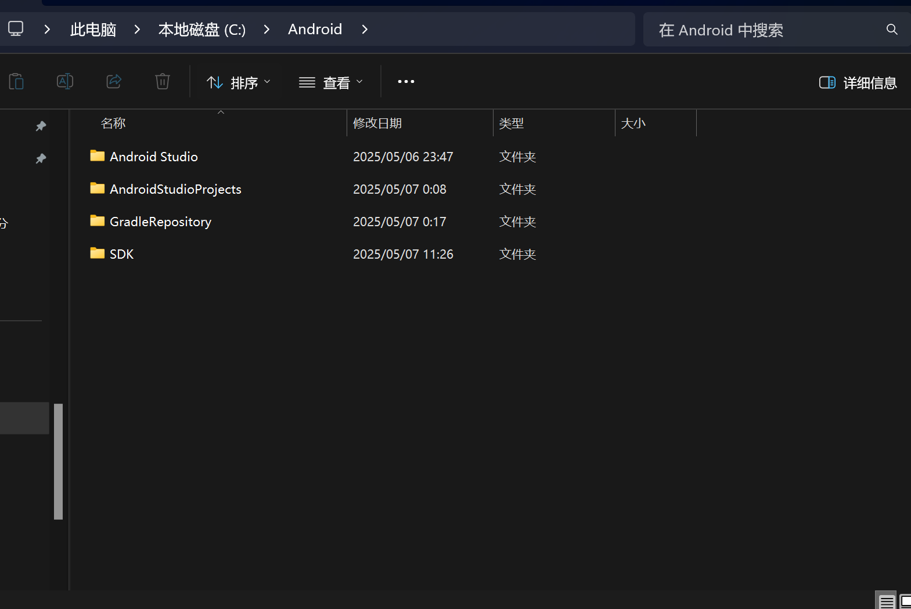
  <p align="center" style="color: #666; font-size: 14px">图1：配置完环境后的目录</p>
</div>

> **目录说明：**
> - `Android Studio`: IDE程序本体安装目录
> - `AndroidStudioProjects`: 默认的项目存放目录，包含所有Android项目
> - `GradleRepository`: Gradle依赖包的本地缓存目录
> - `SDK`: Android SDK的安装目录，包含各版本SDK工具和平台

> **注意事项：**
> 1. 建议将整个Android开发环境放在同一个根目录下便于管理
> 2. 路径中避免使用中文和特殊字符
> 3. 建议安装在非系统盘，保证足够的存储空间

### Android Studio 下载与安装 <!-- markmap: fold -->
确保在开始安装之前已经按照上一步新建好文件夹了。此步骤仅仅只是安装这个IDE，环境还没配置好，所以安装完成后先不用直接打开。
点击右边链接下载 [android-studio-2024.1.2.12-windows.exe][3]安装包。
<div align="center">
  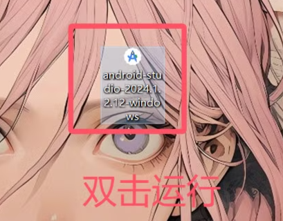
  <p align="center" style="color: #666; font-size: 14px">图1：找到安装包位置并双击运行</p>
</div>
<div align="center">
  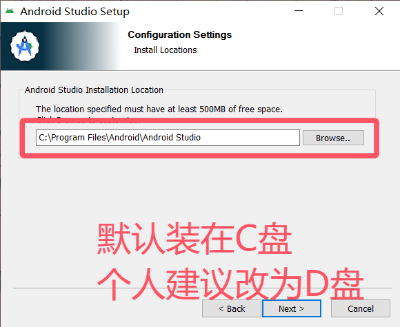
  <p align="center" style="color: #666; font-size: 14px">图2：修改安装目录为D:\Android\Android Studio</p>
</div>
<div align="center">
  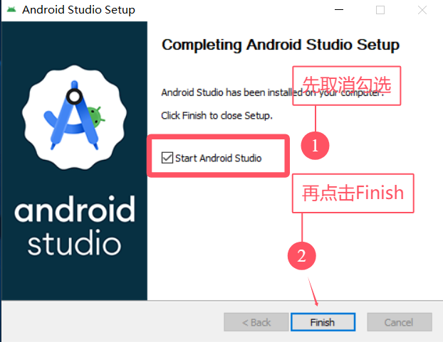
  <p align="center" style="color: #666; font-size: 14px">图3：等待安装完成时取消勾选"Start Android Studio"，然后点击Finsh</p>
</div>

### JDK 安装与环境变量配置 <!-- markmap: fold -->

已经在电脑中安装过JDK的仍然建议`为统一JDK版本`，额外安装一遍。

#### (1) JDK安装
点击右边链接下载 [JDK17直链下载][4],然后找到你下载的压缩包位置。
<div align="center">
  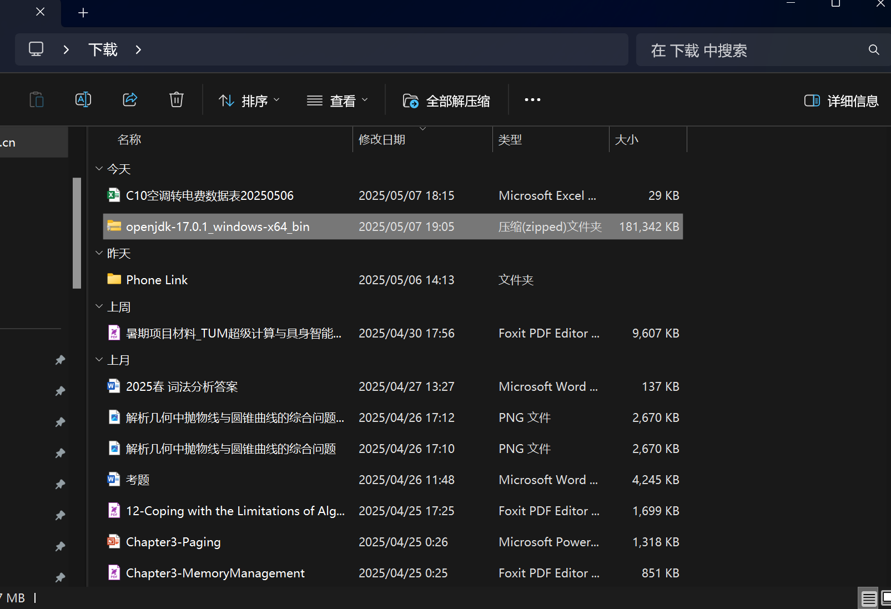
  <p align="center" style="color: #666; font-size: 14px">图1：我下载的位置</p>
</div>

将这个压缩包解压到目录`C:\`。然后确认你的`C盘根目录`下是否存在下图所示文件夹(名字应当是完全一样的)。

目录结构：
```
C:\
└── jdk-17.0.1
```
#### (2) JDK 环境变量配置

##### 命令行配置 (已经验证有效，强烈建议使用此脚本!!!!!!!!!!!!!)
以管理员身份打开 PowerShell（右键点击 PowerShell 图标，选择"以管理员身份运行"），然后复制粘贴以下命令：

```powershell
# 设置 JAVA_HOME 环境变量
$javaHome = "C:\jdk-17.0.1"
[Environment]::SetEnvironmentVariable("JAVA_HOME", $javaHome, "Machine")

# 将 Java bin 目录添加到 PATH 环境变量,并添加到环境变量列表的最前端以覆盖其他jdk。
$path = [Environment]::GetEnvironmentVariable("Path", "Machine")
$javaBin = "$javaHome\bin"
[Environment]::SetEnvironmentVariable("Path", "$javaBin;$path", "Machine")


# 验证环境变量是否设置成功
Write-Host "JAVA_HOME 已设置为: $([Environment]::GetEnvironmentVariable('JAVA_HOME', 'Machine'))" -ForegroundColor Green
Write-Host "Java 已添加到 PATH 中" -ForegroundColor Green
```

配置完成后，重新打开命令提示符或 PowerShell 窗口，输入 `java -version` 确认 JDK 是否正确配置。你应该能看到类似以下输出：

```
openjdk version "17.0.1" 2021-10-19
OpenJDK Runtime Environment (build 17.0.1+12-39)
OpenJDK 64-Bit Server VM (build 17.0.1+12-39, mixed mode, sharing)
```

> **注意：** 
> - 如果命令执行后提示权限错误，请确保以管理员身份运行 PowerShell
> - 设置环境变量后需要重新打开命令行窗口才能生效

#### 常规windows设置配置

参照[JDK环境配置](https://blog.csdn.net/keiraee/article/details/142321644?sharetype=blog&shareId=142321644&sharerefer=APP&sharesource=keiraee&sharefrom=link#:~:text=1.-,JDK%E7%8E%AF%E5%A2%83%E5%AE%89%E8%A3%85,-%E7%94%B1%E4%BA%8E%E6%88%91%E4%BD%BF%E7%94%A8).

### SDK 配置 <!-- markmap: fold -->


#### SDK安装
- 打开刚刚安装完但是没有打开过的Android Studio。稍等片刻，看到弹出下图界面，点击`Don't Sent`.
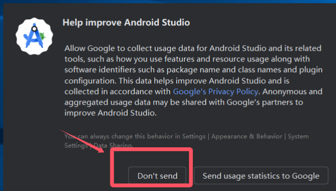

- 如果你是第一次打开，`稍等片刻`后你会碰到如下图所示弹窗，取消即可。
  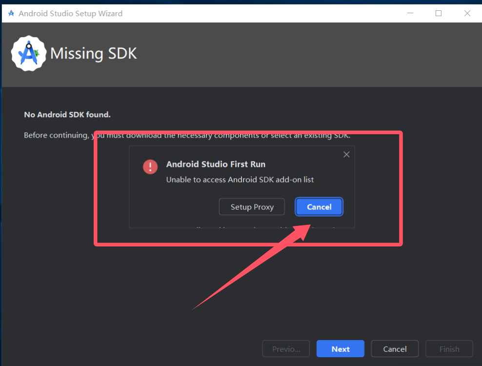

- 然后点击上图中的 `Next` ,跳到如下界面，修改 SDK location 为[你前面准备的安装目录](#PathEnv)
  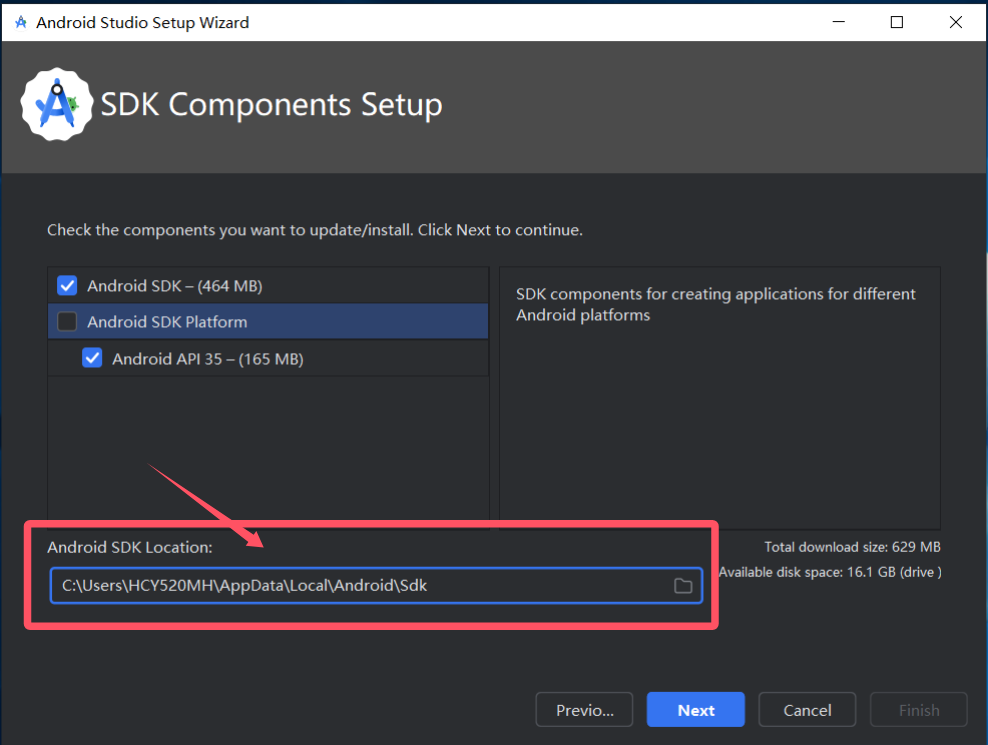
- 然后点击 `Next`,出现下图界面后继续点击 `NExt` ,然后再弹出的界面中选择 `Accept`。
  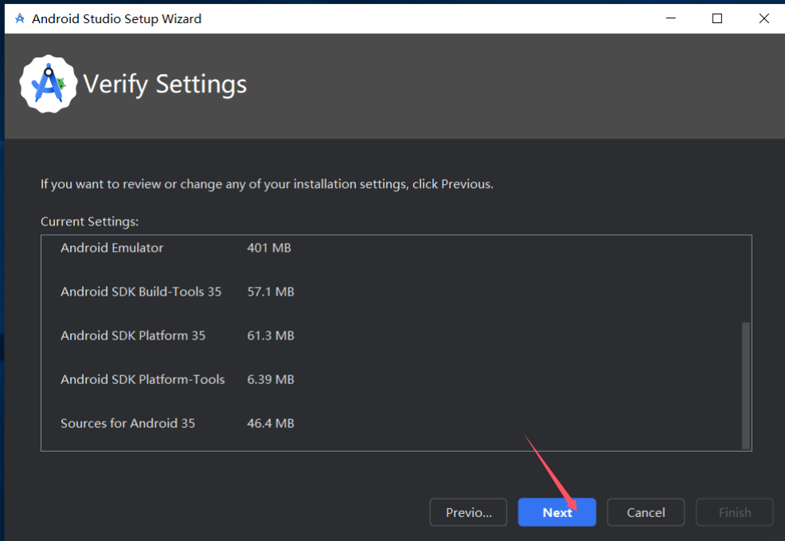
  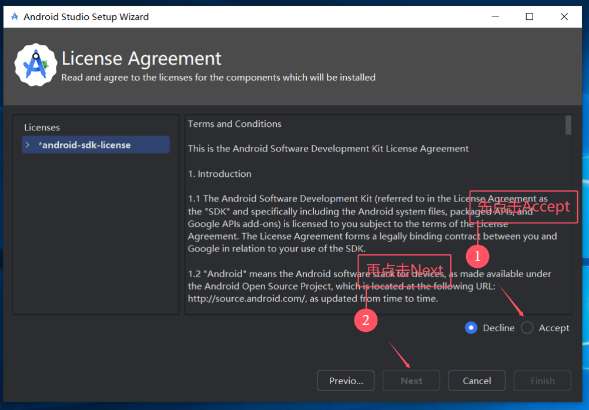
- 然后等待弹出下面的界面，点击 `Finish` 。
  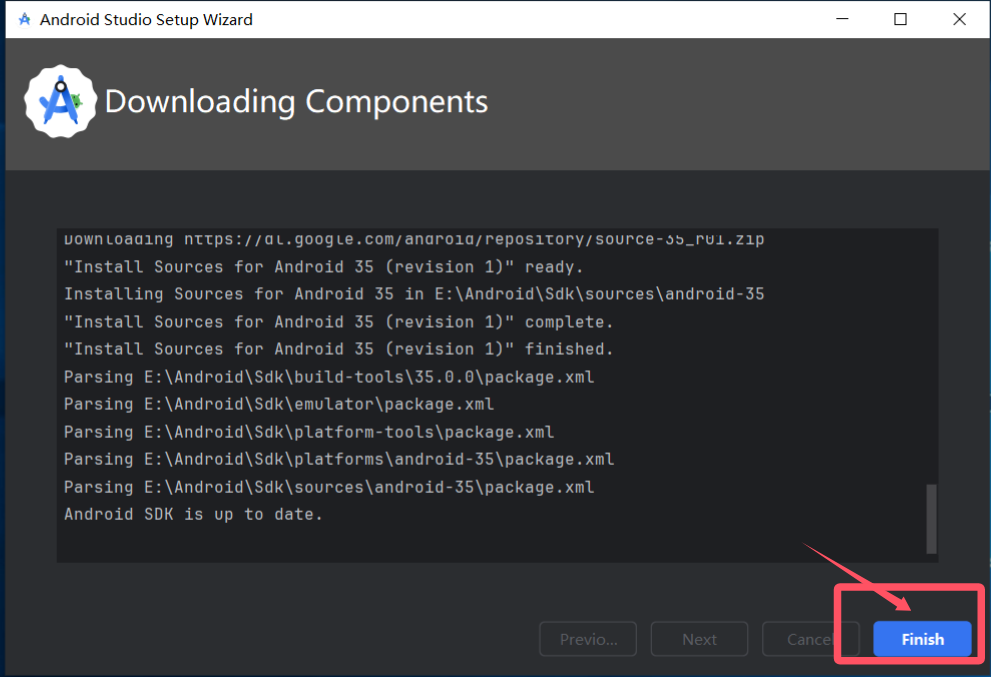
- 然后进入软件，出现下图界面。
  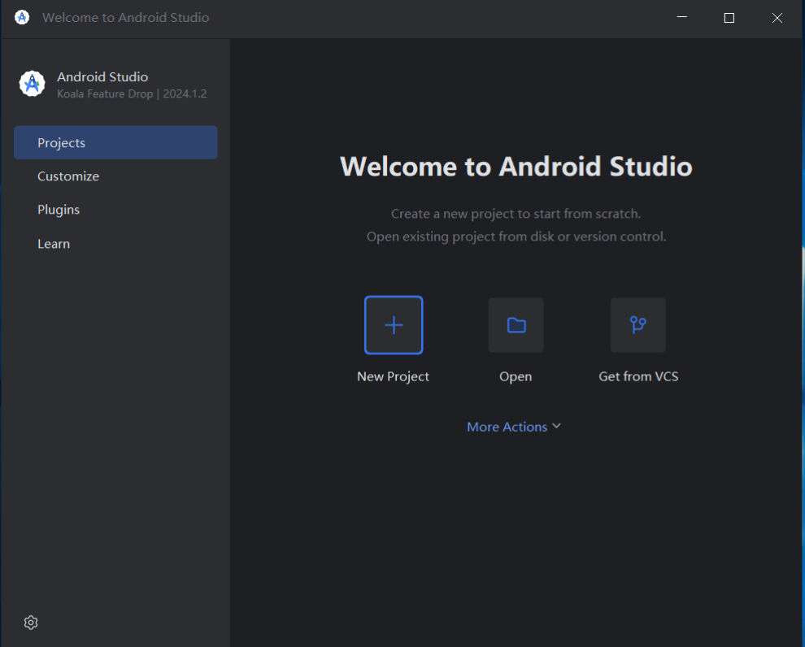
- 这时**直接叉掉**这个界面，继续后面的步骤以配置SDK环境变量

#### SDK环境变量配置


##### PowerShell 脚本配置 (建议使用此方法，但是必须认真阅读该方法说明)
以管理员身份打开 PowerShell，然后复制粘贴以下命令，然后**必须修改**`$androidHome` 为你自己创建的目录，接着再将**修改后的代码**粘贴到命令行中运行。

```powershell
# 设置Android SDK 存放的根目录
$androidHome = "<你的SDK文件夹路径>"  # 根据你的实际安装路径修改,我的是"C:\Android\SDK"

# 向系统环境变量中添加 ANDROID_HOME
[Environment]::SetEnvironmentVariable("ANDROID_HOME", $androidHome, "Machine")

# 向 系统 Path 中添加 Android 工具路径
$path = [Environment]::GetEnvironmentVariable("Path", "Machine")
$platformTools = "$androidHome\platform-tools"
$tools = "$androidHome\tools"

# 检查并添加路径(如果不存在)
if (-not $path.Contains($platformTools)) {
    $path = "$path;$platformTools"
}
if (-not $path.Contains($tools)) {
    $path = "$path;$tools"
}

# 更新Path环境变量
[Environment]::SetEnvironmentVariable("Path", $path, "Machine")

# 验证环境变量
Write-Host "ANDROID_HOME 已设置为: $([Environment]::GetEnvironmentVariable('ANDROID_HOME', 'Machine'))" -ForegroundColor Green
Write-Host "Android 工具已添加到 PATH 中" -ForegroundColor Green
```

配置完成后，重新打开命令提示符或 PowerShell 窗口，输入以下命令验证安装：

```
adb version
```

你应该能看到类似以下输出：

```
Android Debug Bridge version 1.0.41
Version 35.0.2-12147458
Installed as C:\Android\SDK\platform-tools\adb.exe
Running on Windows 10.0.22631
```

> **注意：**
> - 请确保将 `$androidHome` 变量中的路径替换为你实际安装 SDK 的路径
> - 设置环境变量后需要重新打开命令行窗口才能生效

##### 图形化配置

参照[原教程](https://blog.csdn.net/keiraee/article/details/142321644?sharetype=blog&shareId=142321644&sharerefer=APP&sharesource=keiraee&sharefrom=link#:~:text=%E5%88%B0%E8%BF%99%E4%B8%AA%E5%9C%B0%E6%96%B9%E5%85%88%E5%8F%89%E6%8E%89%E8%BD%AF%E4%BB%B6%EF%BC%8C%E6%88%91%E4%BB%AC%E5%85%88%E7%BB%A7%E7%BB%AD%E9%85%8D%E7%BD%AE%E7%8E%AF%E5%A2%83)


### Gradle 构建工具配置 （很多坑点，但主要是网络环境问题）<!-- markmap: fold -->

#### 重新打开 Android Studio，然后检查下面的设置是否自动调整准确
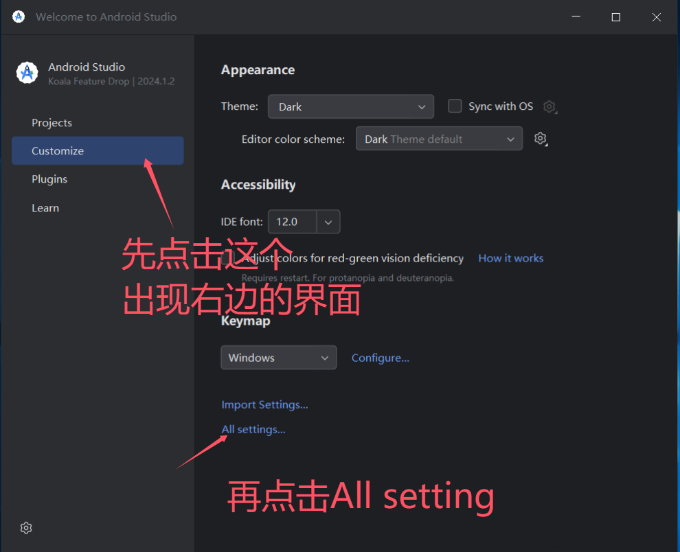
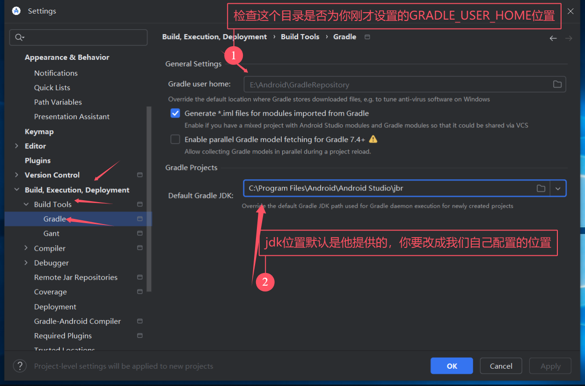
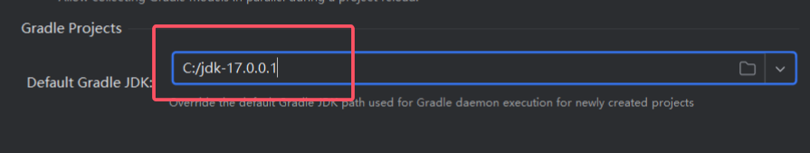

#### 进行Gradle下载和GradleRepository依赖库下载

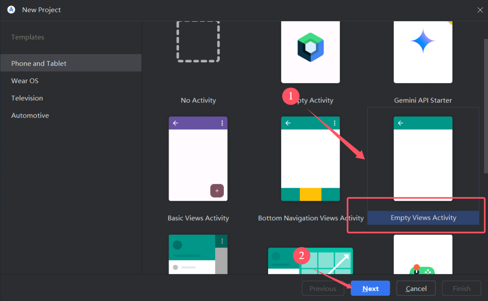

下面的已经在[之前的目录准备](#PathEnv)中创建了。

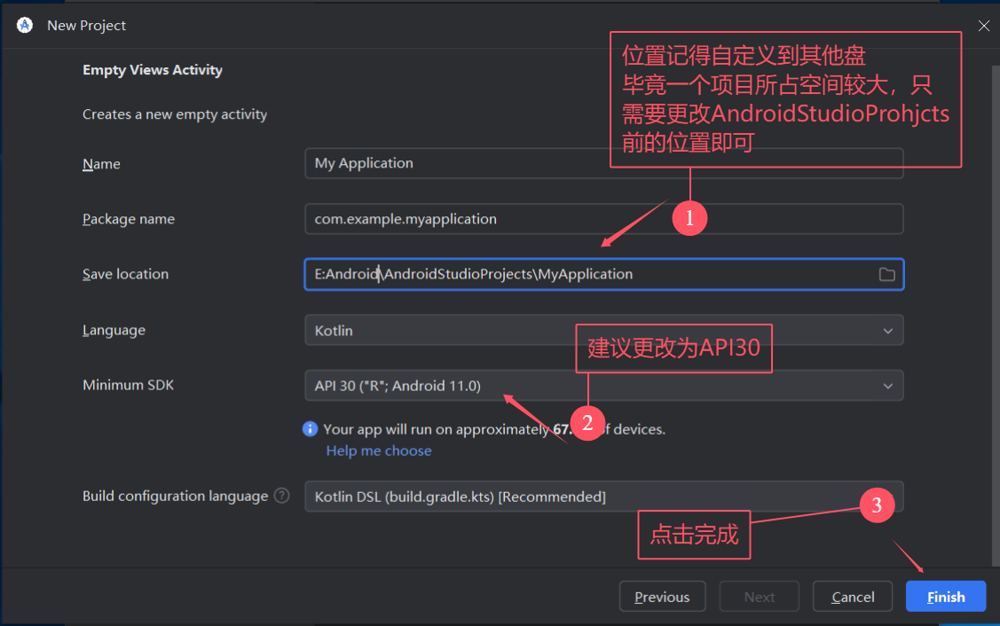
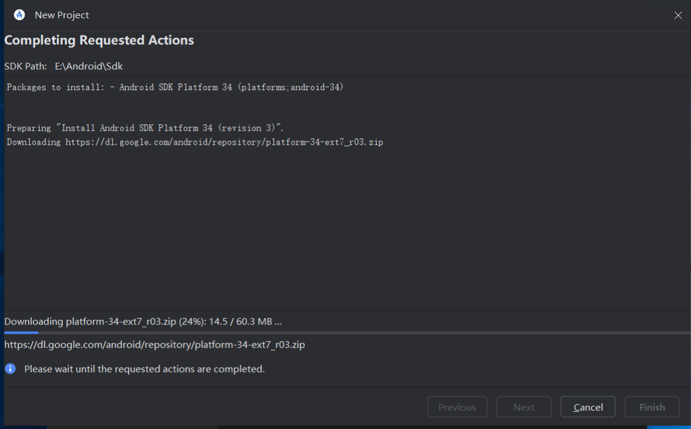
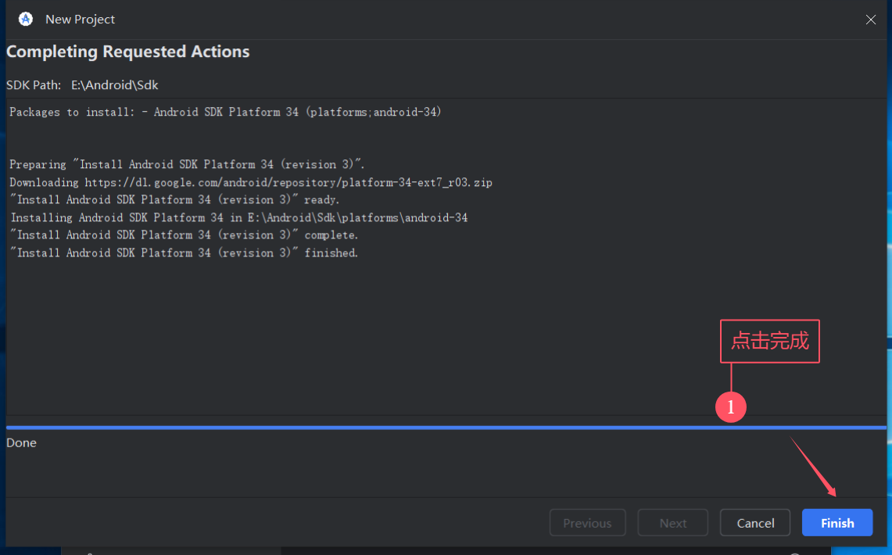

**接下来的操作有所不同，如果你有科学上网，那么请`不要点击停止`，等待自动安装完成。**

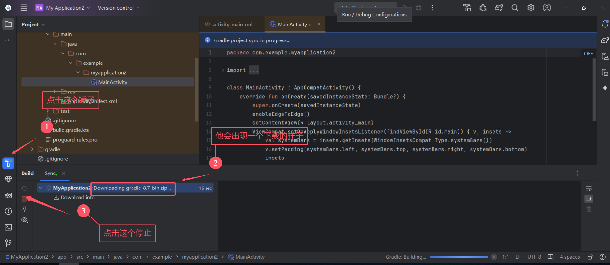
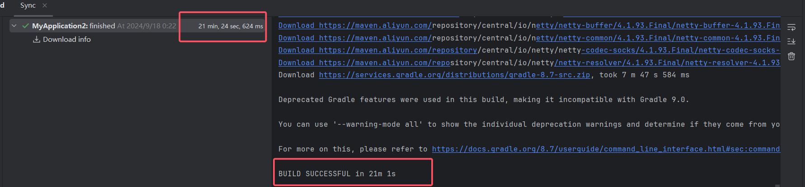

### Android Studio 汉化

[参考这个GitHub仓库链接][5]


### Android 虚拟机配置与使用 


## 学习在 Android Studio 使用git 进行项目管理
以下教程基于如下平台与资料：
- [Learning Git Branch][6]：一个交互式的学习github命令行操作的网站，强烈推荐。
- [Git doc][7]: Git 官方文档
- [JetBrains IDEs Git Integration Documentation](https://www.jetbrains.com/zh-cn/help/idea/2025.1/version-control-integration.html): JetBrains 家 IDE 内部集成Git工具的官方文档。
- [git config 命令使用入门](https://blog.csdn.net/ShuSheng0007/article/details/115449596)
### 学习本地仓库进行版本管理
- **在 JetBrains IDE 中初始化 Git 仓库**
- **理解 IDE 中的暂存区 (Staging Area / Changelists)**
- **提交更改 (Commit) 与查看历史 (Log)**
  - 如何使用 IDE 的提交界面
  - 编写规范的提交信息
  - 通过 IDE 查看提交历史、分支图
- **分支管理 (Branching)**
  - 在 IDE 中创建、切换、合并和删除分支
- **标签管理 (Tagging)**
  - 在 IDE 中创建和推送标签

### 学习使用远程仓库进行协作并处理冲突 (JetBrains IDE 实战)
- **连接到远程仓库**
  - 在 IDE 中克隆 (Clone) 远程仓库
  - 在 IDE 中添加远程仓库 (Remotes)
- **基本的远程操作**
  - **推送 (Push)**：将本地提交推送到远程仓库
    - 使用 IDE 的 Push 对话框
  - **拉取 (Pull)**：从远程仓库获取最新更改并合并
    - Fetch 与 Pull 的区别
    - 在 IDE 中执行 Pull 操作 (Merge vs Rebase)
  - **获取 (Fetch)**：从远程仓库获取最新更改但不合并
- **协作工作流 (以 Feature Branch Workflow 为例)**
  - **创建和推送特性分支**：在 IDE 中为新功能或修复创建分支并推送到远程。
  - **团队成员间的代码同步**：定期 Pull 主分支或开发分支的更新。
  - **发起合并请求 (Pull Request / Merge Request)**：
    - 虽然 PR/MR 通常在代码托管平台（如 GitHub, GitLab）上创建，但可以说明如何在 IDE 中准备好分支以供审查。
    - 如何在 IDE 中检出 (Checkout) 他人的 PR/MR 分支进行审查和测试。
- **处理合并冲突 (Conflict Resolution)**
  - 冲突是如何产生的
  - **使用 JetBrains IDE 的三方合并工具**：详细步骤说明如何识别冲突文件，并使用 IDE 内置的强大合并工具解决冲突。
  - 提交解决冲突后的代码
- **其他有用的协作功能**
  - **储藏 (Stash)**：在 IDE 中临时保存未完成的更改。
  - **拣选 (Cherry-pick)**：在 IDE 中选择性地将某些提交应用到当前分支。
  - **变基 (Rebase)**：在 IDE 中使用 Rebase 功能保持提交历史的整洁（特别是与远程主分支同步时）。

### 常见协作问题与 JetBrains IDE 解决方案
- 例如：推送被拒绝 (Push Rejected) 如何处理等。


## 学习使用 Java 在安卓平台上开发

## 项目建模与文档形成

### Use-Case Model (用例模型)

### Vision (愿景文档)

### Supplementary Specification （补充规格说明）

### Glossary (术语表)

### Iteration Plan （迭代计划）


## 参考


[1]: https://blog.csdn.net/keiraee/article/details/142321644?sharetype=blog&shareId=142321644&sharerefer=APP&sharesource=keiraee&sharefrom=link
[2]: https://www.bilibili.com/video/BV1EePKeUEri/?spm_id_from=333.1007.top_right_bar_window_custom_collection.content.click&vd_source=a4872c0f2359cf40962f6f2cc21fbb17
[3]: https://redirector.gvt1.com/edgedl/android/studio/install/2024.1.2.12/android-studio-2024.1.2.12-windows.exe
[4]: https://download.java.net/java/GA/jdk17.0.1/2a2082e5a09d4267845be086888add4f/12/GPL/openjdk-17.0.1_windows-x64_bin.zip
[5]: https://github.com/sollyu/AndroidStudioChineseLanguagePack?tab=readme-ov-file
[6]: https://learngitbranching.js.org/
[7]: https://git-scm.com/doc